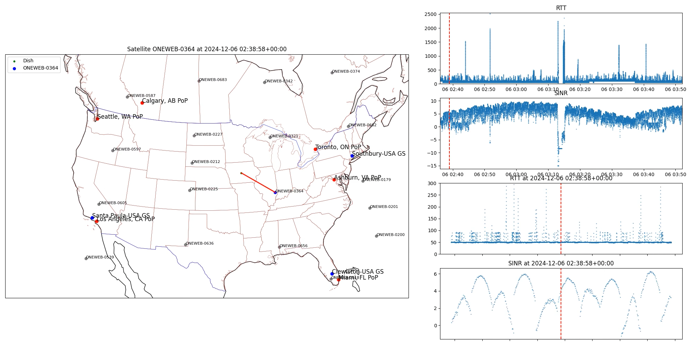

# LEOViz

## Starlink


The method used to estimate the connected satellites is based on our previous paper [Trajectory-based Serving Satellite Identification with User Terminal's Field-of-View](https://dl.acm.org/doi/10.1145/3697253.3697266).

```bibtex
@inproceedings{10.1145/3697253.3697266,
author = {Ahangarpour, Ali and Zhao, Jinwei and Pan, Jianping},
title = {Trajectory-based Serving Satellite Identification with User Terminal's Field-of-View},
year = {2024},
isbn = {9798400712807},
publisher = {Association for Computing Machinery},
address = {New York, NY, USA},
url = {https://doi.org/10.1145/3697253.3697266},
doi = {10.1145/3697253.3697266},
abstract = {Low-Earth-Orbit (LEO) satellite networks, such as SpaceX's Starlink, achieved global broadband Internet coverage with significantly lower latency and higher throughput than traditional satellite Internet service providers utilizing geostationary satellites. Despite the substantial advancements, the research community lacks detailed insights into the internal mechanisms of these networks. This paper presents the first systematic study of Starlink's obstruction map and serving satellite identification. Our method achieves almost unambiguous satellite identification by incorporating satellite trajectories and proposing an accurate Field-of-View (FOV) estimation approach. We validate our methodology using multiple Starlink dishes with varying alignment parameters and latitudes across different continents. We utilize Two-Line Element data to identify the available satellites within the user terminal's FOV and examine their characteristics, in comparison to those of the serving satellites. Our approach revealed a correlation between the satellite selection strategy and the user terminal to gateway latency. The findings contribute to the broader understanding of the architecture of LEO satellite networks and their impact on user experience.},
booktitle = {Proceedings of the 2nd International Workshop on LEO Networking and Communication},
pages = {55–60},
numpages = {6},
keywords = {Field-of-View, Low Earth Orbit Satellite Networks, Satellite Identification},
location = {Washington, DC, USA},
series = {LEO-NET '24}
}
```

## OneWeb



The measurement scripts are compatible and tested with the following OneWeb user terminals

+ Hughes HL1120

⚠️ **To be added.**